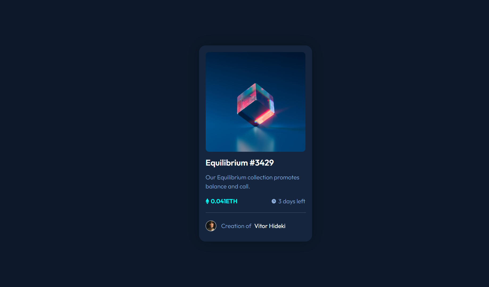

## Índice

  - [O desafio](#o-desafio)
  - [Captura de tela](#captura-de-tela)
  - [Descrição do projeto](#descrição-projeto)
  - [Construído com](#construído-com)
  - [O que aprendi](#o-que-aprendi)
  - [Desenvolvimento contínuo](#desenvolvimento-contínuo)
  - [Recursos úteis](#useful-resources)


### O desafio

Os usuários devem ser capazes de:

- Veja o layout ideal dependendo do tamanho da tela do dispositivo
- Veja os estados de foco para elementos interativos

### Captura de tela



### Descrição do projeto

Um componente do cartão de vizualização NFT, uma representação de um item exclusivo Equilibrium. 


### Construído com

-HTML5
-CSS
-FlexBox

### O que eu aprendi

No desenvolvimento desse projeto eu aprendi como posicionar os elementos utilizando o FlexBox. Aprendi também sobre o box-shadow, que foi utilizado para criar a sombra atras do Card, e sobre o viewport, para a utilização total do nosso dispositivo.


```css
 .principal{
    display: flex;
    justify-content: center;
    align-items: center;
    width: 100vw;
    height: 100vh;
}

.Equilibrium{
    background: hsl(216, 50%, 16%);
    width: 300px;
    height: 550px;
    padding: 20px;
    display: flex;
    justify-content: flex-start;
    flex-direction:column;
    border-radius: 20px;
    font-family: 'Outfit', sans-serif;
    box-shadow: 0px 0px 35px 20px rgba(0, 0, 0, 0.162);
} 
```

### Desenvolvimento contínuo

Para projetos futuros eu busco melhorias no posicionamento dos meu elementos utilizando o flexbox, buscar deixar meu codigo mais responsivo e limpo. Também pretendo utilizar e conhecer melhor sobre o transition.


### Recursos úteis

-[Centralizar container no centro da página](https://css-tricks.com/snippets/css/a-guide-to-flexbox/) - Esse guia me ajudou bastante para o posicionamento dos elementos pais e elementos filhos. Um guia muito bem explicado e se faz útil para diversas aplicações.

-[Unidade de medidas no css](https://medium.com/@tassiogoncalvesg/entenda-de-uma-vez-por-todas-como-utilizar-o-height-100-no-css-6d72914a6748#:~:text=Height%20100%25%2C%20utilizando%20porcentagem&text=O%20width%3A%20100%25%20funciona%2C,conseguimos%20calcular%20o%20height%20100%25.) - Um artigo com uma explicação simples e rápida que me fez entender melhor as unidades de medida do css.

